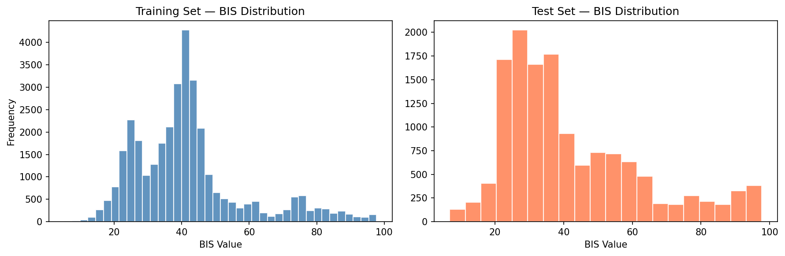
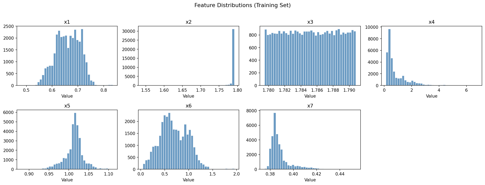
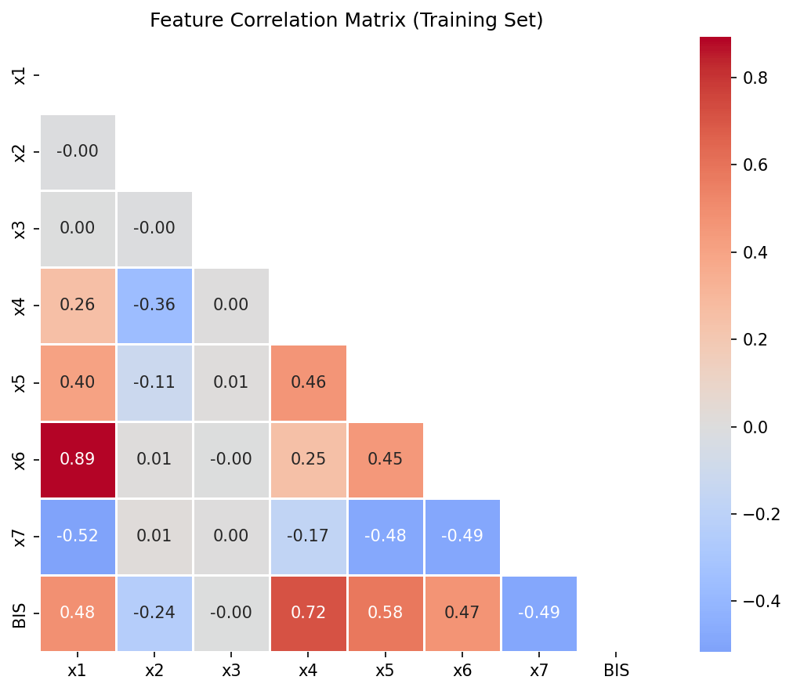
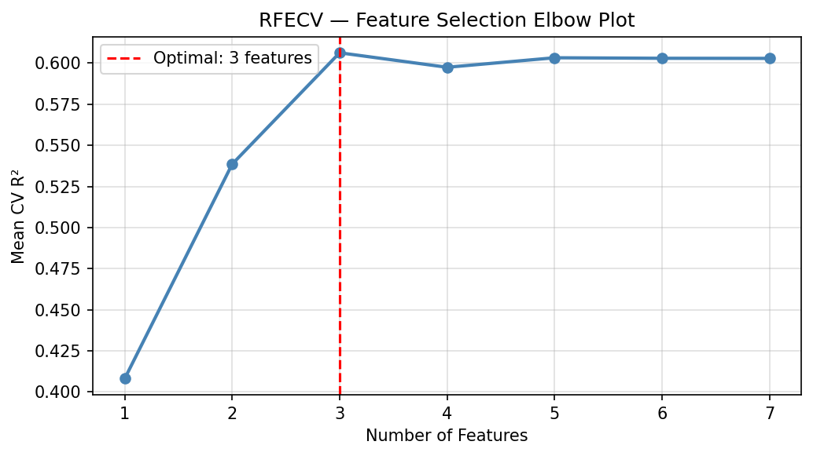
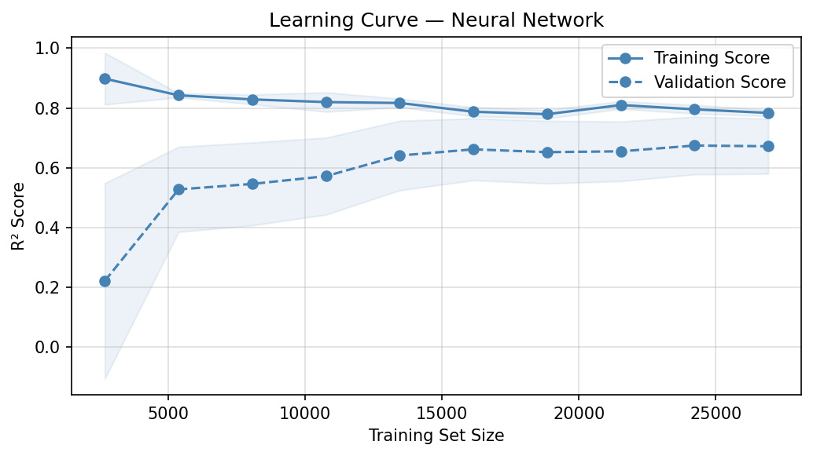
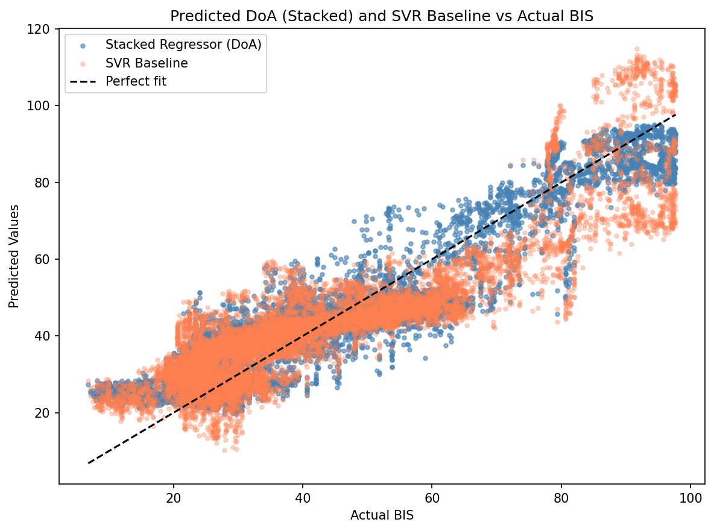
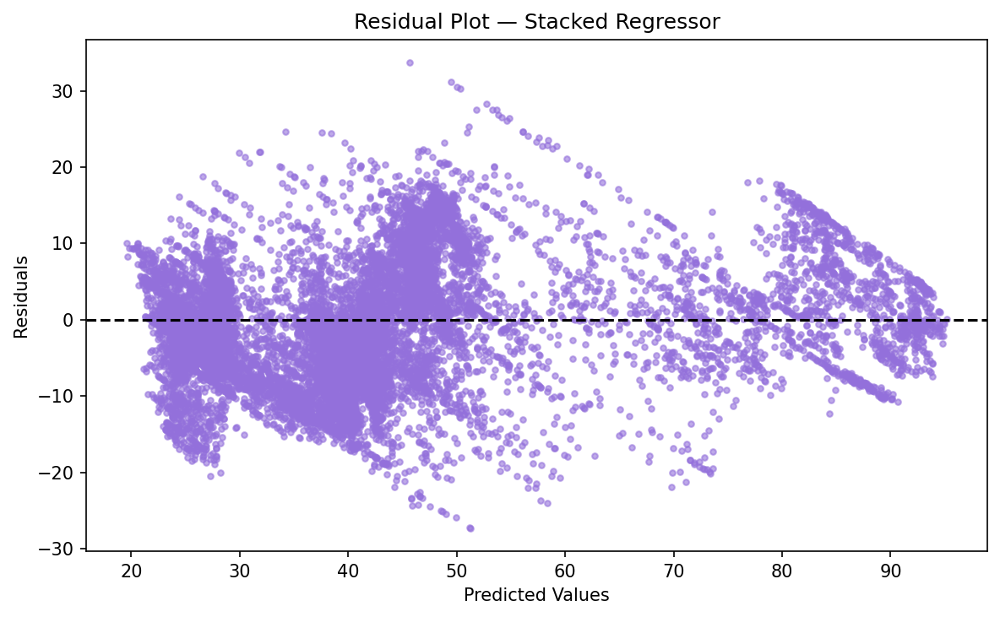
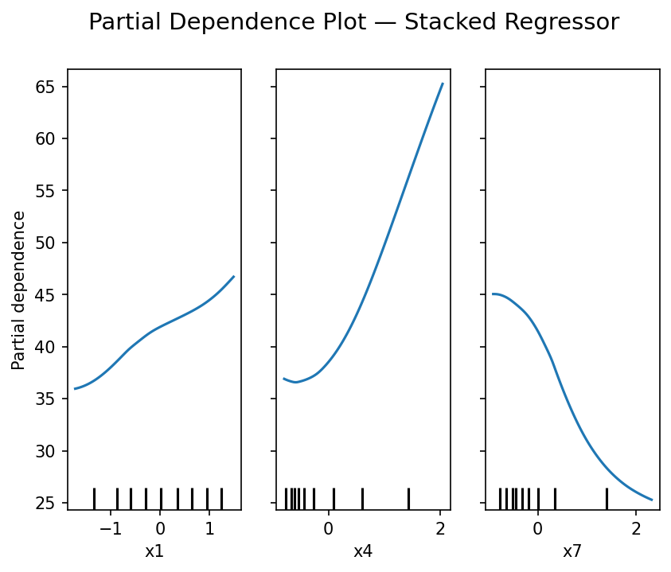

# Neural Network/SVM Hybrid Model - Depth of Anaesthesia Index

This repository demonstrates the development of a Depth of Anaesthesia (DoA) index using supervised machine learning techniques. The project trains ML models on raw EEG features to predict BIS values more accurately than a simple SVR baseline, showing that a stacked ensemble approach can outperform a single model on this clinical prediction task.

### Achievements:
- Developed a stacked ensemble model (Neural Network + SVR) achieving **MSE: 63.87, R²: 0.845, MAE: 6.45**, a significant improvement over the SVR baseline (MSE: 91.70, R²: 0.777).
- Reduced 7 EEG features to 3 using RFECV, confirmed by an elbow plot showing performance plateauing beyond 3 features.
- Applied hyperparameter tuning via GridSearchCV to both the SVR and Neural Network models.

<div align="center">
  
</div>

## Table of Contents
1. [Project Structure](#project-structure)
2. [Dataset Description](#dataset-description)
3. [Exploratory Data Analysis](#exploratory-data-analysis)
4. [Feature Selection](#feature-selection)
5. [Neural Network Model](#neural-network-model)
6. [Stacked Regressor](#stacked-regressor)
7. [Comparative Analysis](#comparative-analysis)
8. [Tools and Libraries](#tools-and-libraries)
9. [Key Findings](#key-findings)


## Project Structure

### Data Preparation
- **Cleaning:** Removal of outliers and missing values.
- **Standardisation:** Scaling features to ensure uniformity and unbiased modelling.
- **EDA:** Distribution and correlation analysis to understand feature relationships before modelling.

### Modelling
- **RFECV-SVM:** Identifies key features for predictive modelling.
- **Hyperparameter Tuning:** GridSearchCV applied to SVR and Neural Network to optimise model configurations.
- **Neural Network:** Captures complex, non-linear relationships in the data.
- **Stacked Regressor:** Combines Neural Network and SVM outputs for improved accuracy.
- **Comparative analysis:** Testing model performance against the partitioned-off testing dataset.

### Visualisation
- **EDA Plots:** BIS distributions, feature distributions, and correlation heatmap.
- **Learning Curves:** Training and validation performance analysis.
- **Scatterplots:** Comparison of predicted DoA values against BIS.
- **Residual Plots:** Assessment of prediction errors.
- **Partial Dependence Plots:** Interpret feature influence on predictions.


<div align="center">
  
</div>

***Figure 1:*** The four key stages for this project, Figure 1 shows the direction of travel for the data throughout its lifecycle.

## Dataset Description

The dataset comprises electroencephalography (EEG) data collected to estimate the Depth of Anaesthesia (DoA). It includes **12 training** sets and **5 testing sets**, each containing features extracted from EEG signals. The **target variable, `BIS`**, is the Bispectral Index — the clinical gold-standard DoA measurement produced by a dedicated BIS monitor — and serves as the ground truth label for all models.

### Dataset Schema
Each dataset contains the following columns:
- **BIS**: Bispectral index, the target variable for depth of anaesthesia.
- **x1 to x7**: Features derived from EEG signal analysis.

### Sample Data
Example structure (first three rows) of one of the 17 datasets collected from an EEG machine:

| BIS  | x1       | x2       | x3       | x4       | x5       | x6       | x7       |
|------|----------|----------|----------|----------|----------|----------|----------|
| 80.0 | 0.705208 | 1.790486 | 1.789550 | 2.090912 | 1.049270 | 0.962221 | 0.383604 |
| 80.1 | 0.709311 | 1.790486 | 1.787953 | 2.100403 | 1.051117 | 0.997764 | 0.385352 |
| 82.1 | 0.707605 | 1.790482 | 1.781845 | 2.096846 | 1.051277 | 1.005539 | 0.383615 |
| ...  | ...      | ...      | ...      | ...      | ...      | ...      | ...      |

## Exploratory Data Analysis

Before modelling, the data was examined to understand target and feature distributions, and to identify which features correlate most strongly with BIS.

<div align="center">
  
</div>

***Figure 2:*** BIS distribution across training (blue) and test (coral) sets. The training distribution is bimodal, with peaks around 25–30 and 40–45, reflecting patients at different anaesthesia depths. The test set follows a similar shape, confirming the split is representative.

<div align="center">
  
</div>

***Figure 3:*** Individual feature distributions. Features x2 and x3 are tightly clustered with very low variance, suggesting limited predictive power. Feature x4 shows a strong right skew. These patterns informed the subsequent feature selection step.

<div align="center">
  
</div>

***Figure 4:*** Feature correlation matrix. x1, x4, and x7 show the strongest correlations with BIS (all negative), consistent with the features later selected by RFECV. x2 and x3 are highly correlated with each other but weakly correlated with BIS, explaining their removal.

## Feature Selection

Feature selection using Recursive Feature Elimination with Cross-Validation (RFECV) with Support Vector Machine (SVM) reduced the dataset to three key features: **x1, x4, and x7**, minimising noise and computational complexity while enhancing model performance. SVM was chosen for its effectiveness in high-dimensional spaces and its ability to handle non-linear relationships during feature selection.

**Key Code:**
```python
from sklearn.svm import SVR
from sklearn.feature_selection import RFECV
from sklearn.model_selection import KFold

svr_selector = SVR(kernel="linear")
rfecv = RFECV(estimator=svr_selector, step=1, cv=KFold(n_splits=5), scoring='r2', n_jobs=-1)
rfecv.fit(X_scaled, y)
selected_features = X_train.columns[rfecv.support_].tolist()
```

<div align="center">
  
</div>

***Figure 5:*** RFECV elbow plot showing mean cross-validated R² as each feature is added. Performance peaks at 3 features (x1, x4, x7) and plateaus or declines beyond that, confirming the optimal subset.

## Neural Network Model

A Multilayer Perceptron Neural Network was implemented with two hidden layers. Architecture and regularisation hyperparameters were optimised via GridSearchCV before final training with early stopping to prevent overfitting.

**Key Code:**
```python
from sklearn.model_selection import GridSearchCV
from sklearn.neural_network import MLPRegressor

nn_param_grid = {
    'hidden_layer_sizes': [(50, 30), (100, 50), (100, 50, 25), (50,)],
    'alpha': [0.0001, 0.001, 0.01]
}
nn_grid = GridSearchCV(MLPRegressor(activation='relu', max_iter=1000, random_state=42),
                       nn_param_grid, cv=KFold(n_splits=5), scoring='r2', n_jobs=-1)
nn_grid.fit(X_train_selected_scaled, y_train)

nn_model = MLPRegressor(**nn_grid.best_params_, activation='relu', max_iter=1000,
                        random_state=42, early_stopping=True, validation_fraction=0.1)
nn_model.fit(X_train_selected_scaled, y_train)
```

### Neural Network Results:
- **MSE:** 64.334
- **MAE:** 6.401
- **R²:** 0.844
- **Pearson Correlation Coefficient:** 0.921

**Learning Curve:**
<div align="center">
  
</div>

***Figure 6:*** The learning curve of the R² metrics for training and validation, as the training set size increased.


## Stacked Regressor

The final DoA index combined Neural Network and SVR predictions through a linear regression meta-model to further increase accuracy using derived meta-features. The Stacked Regressor approach leverages the complementary strengths of both base models, with the meta-model learning their optimal weighting.

**Key Code:**
```python
from sklearn.ensemble import StackingRegressor
from sklearn.linear_model import LinearRegression

stacking_model = StackingRegressor(
    estimators=[('nn', nn_model), ('svr', svr_model)],
    final_estimator=LinearRegression(),
    n_jobs=-1
)
stacking_model.fit(X_train_selected_scaled, y_train)
```

### Stacked Regressor Results:
- **MSE:** 63.874
- **MAE:** 6.448
- **R²:** 0.845
- **Pearson Correlation Coefficient:** 0.924
- **Meta-model weights:** ~63% Neural Network, ~37% SVR

<div align="center">
  
</div>

***Figure 7:*** Stacked Regressor (DoA) and SVR baseline predictions plotted against actual BIS values. The DoA predictions cluster more tightly around the perfect-fit line.

<div align="center">
  
</div>

***Figure 8:*** Residual plot for the stacked model. It is mostly random, with slight systematic patterns, confirming the model may contain a small degree of bias.


## Comparative Analysis

Performance of the SVR baseline, Neural Network, and Stacked Regressor — all trained on the training datasets — was evaluated against the held-out test datasets. All three models predict BIS values from raw EEG features; the SVR serves as a simple baseline, and the results show that both the Neural Network and Stacked Regressor significantly outperform it.

| Model             | MSE    | MAE   | R²    | Pearson |
|-------------------|--------|-------|-------|---------|
| SVR Baseline      | 91.696 | 7.697 | 0.777 | 0.885   |
| Neural Network    | 64.334 | 6.401 | 0.844 | 0.921   |
| Stacked Regressor | **63.874** | **6.448** | **0.845** | **0.924** |

**Partial Dependence Plot:**

The partial dependence plot shows the marginal relationship of each selected feature with the Stacked Regressor's predictions. Features x1 and x4 have a positive relationship with DoA, while x7 has a negative relationship.

<div align="center">
  
</div>

***Figure 9:*** In the stacked regressor model, the three most predictive variables have a combination of positive and negative effect upon the predicted DoA.

## Tools and Libraries

- **Python:** Main programming language.
- **Pandas:** Efficient tabular data handling.
- **NumPy:** High-performance numerical computations.
- **Scikit-learn:** Machine learning model development, feature selection, hyperparameter tuning, and evaluation.
- **Matplotlib:** Data visualisation.
- **Seaborn:** Visualising statistical plots.

## Key Findings

1. RFECV-SVM reduced the 7 EEG features to 3 (x1, x4, x7), confirmed by the elbow plot, decreasing computational overhead while retaining predictive power. Correlation analysis showed these three features also had the strongest individual relationships with BIS.
2. The Neural Network significantly outperformed the SVR baseline (R² 0.844 vs 0.777, MAE 6.40 vs 7.70), demonstrating that non-linear modelling of EEG features yields a measurably better DoA predictor.
3. The Stacked Regressor produced the best results overall (R² 0.845, MSE 63.87), with the meta-model placing ~63% weight on the NN and ~37% on the SVR, indicating the NN drives most of the predictive power, with the SVR providing a complementary correction.
