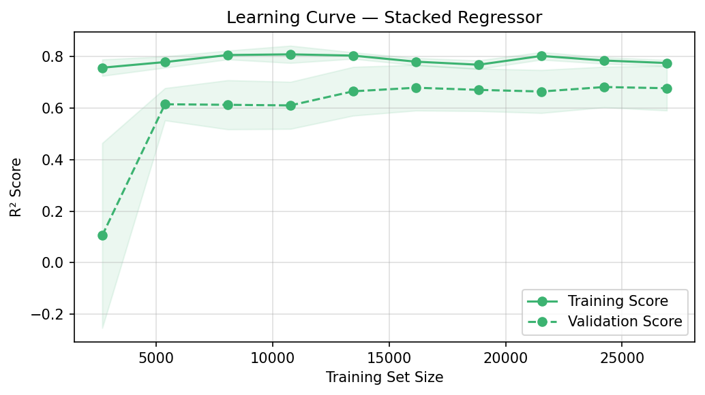

# Neural Network/SVM Hybrid Model - Depth of Anaesthesia Index

This repository develops a Depth of Anaesthesia (DoA) index using supervised machine learning, completed as a university assignment for the Master of Data Science (USQ). The project trains regression models on EEG-derived features to predict the Bispectral Index (BIS), comparing an SVR baseline, a tuned neural network, and a stacked ensemble of the two, all evaluated on held-out test recordings.

### Achievements:
- Built a tuned neural network achieving R²: 0.844, MSE: 64.33, MAE: 6.40 on the held-out test set — a substantial gain over the SVR baseline (R²: 0.777, MSE: 91.70).
- Stacked the NN and SVR via a linear meta-model for a marginal further improvement (R²: 0.845, MSE: 63.87); most of the lift over the baseline comes from the NN, not the stacking.
- Reduced 7 EEG features to 3 (x1, x4, x7) using RFECV, confirmed by an elbow plot showing cross-validated R² plateauing beyond 3 features.
- Tuned both the SVR and neural network via GridSearchCV with 5-fold cross-validation.

<div align="center">
  
</div>

## Table of Contents
1. [Project Structure](#project-structure)
2. [Dataset Description](#dataset-description)
3. [Exploratory Data Analysis](#exploratory-data-analysis)
4. [Feature Selection](#feature-selection)
5. [SVR Baseline](#svr-baseline)
6. [Neural Network Model](#neural-network-model)
7. [Stacked Regressor](#stacked-regressor)
8. [Comparative Analysis](#comparative-analysis)
9. [How to Run](#how-to-run)
10. [Tools and Libraries](#tools-and-libraries)
11. [Key Findings](#key-findings)
12. [Limitations](#limitations)


## Project Structure

### Data Preparation
- **EDA:** Target/feature distribution and correlation analysis to understand the data before modelling.
- **Feature/target split:** `x1`–`x7` separated from the `BIS` target for both the training and test recordings.
- **Standardisation:** Two `StandardScaler`s are used — one fitted on the full feature set for RFECV, and a second fitted on the reduced (3-feature) set and applied to all downstream models. No explicit outlier or missing-value removal step is applied; the raw EEG features are used as supplied.

### Modelling
- **RFECV-SVM:** Identifies key features for predictive modelling.
- **Hyperparameter Tuning:** GridSearchCV applied to SVR and Neural Network to optimise model configurations.
- **Neural Network:** Captures complex, non-linear relationships in the data.
- **Stacked Regressor:** Combines Neural Network and SVM outputs for improved accuracy.
- **Comparative analysis:** Testing model performance against the partitioned-off testing dataset.

### Visualisation
- **EDA Plots:** BIS distributions, feature distributions, and correlation heatmap.
- **Learning Curves:** Training and validation performance analysis.
- **Scatterplots:** Comparison of predicted DoA values against BIS.
- **Residual Plots:** Assessment of prediction errors.
- **Partial Dependence Plots:** Interpret feature influence on predictions.


<div align="center">
  
</div>

***Figure 1:*** The four key stages for this project, Figure 1 shows the direction of travel for the data throughout its lifecycle.

## Dataset Description

The dataset comprises electroencephalography (EEG) data collected to estimate the Depth of Anaesthesia (DoA). It is supplied as a single Excel file (`project_data.xlsx`) of 17 recordings, split into 12 training and 5 testing recordings (sheets `Train-1…12` / `Test-1…5`). These are concatenated into 33,645 training rows and 13,750 test rows. Each row holds features extracted from an EEG signal window. The target variable, `BIS`, is the Bispectral Index — the clinical gold-standard DoA measurement produced by a dedicated BIS monitor — and serves as the ground-truth label for all models.

Because the split is by recording, train and test rows come from different sessions, which is the appropriate way to estimate generalisation here. Note that rows within a recording are temporally autocorrelated, so the cross-validation R² (which shuffles rows) is optimistic relative to the recording-level test results — the held-out test metrics are the ones to trust.

### Dataset Schema
Each dataset contains the following columns:
- **BIS**: Bispectral index, the target variable for depth of anaesthesia.
- **x1 to x7**: Features derived from EEG signal analysis.

### Sample Data
Example structure (first three rows) of one of the 17 datasets collected from an EEG machine:

| BIS  | x1       | x2       | x3       | x4       | x5       | x6       | x7       |
|------|----------|----------|----------|----------|----------|----------|----------|
| 80.0 | 0.705208 | 1.790486 | 1.789550 | 2.090912 | 1.049270 | 0.962221 | 0.383604 |
| 80.1 | 0.709311 | 1.790486 | 1.787953 | 2.100403 | 1.051117 | 0.997764 | 0.385352 |
| 82.1 | 0.707605 | 1.790482 | 1.781845 | 2.096846 | 1.051277 | 1.005539 | 0.383615 |
| ...  | ...      | ...      | ...      | ...      | ...      | ...      | ...      |

## Exploratory Data Analysis

Before modelling, the data was examined to understand target and feature distributions, and to identify which features correlate most strongly with BIS.

<div align="center">
  
</div>

***Figure 2:*** BIS distribution across training (blue) and test (coral) sets. The training distribution is bimodal, with peaks around 25 and 40, reflecting patients held at different anaesthesia depths (mean BIS ≈ 41.7). The test set spans the same 0–100 range and is concentrated in the same 20–60 region, but is more right-skewed and only weakly bimodal — so it is broadly representative rather than an exact match.

<div align="center">
  
</div>

***Figure 3:*** Individual feature distributions. x2 is almost constant (a single spike at ≈1.79, std 0.009) and x3 is near-uniform over a very narrow band (std 0.003); both have negligible variance and limited predictive power. x4 and x7 are strongly right-skewed. These patterns informed the subsequent feature selection step.

<div align="center">
  
</div>

***Figure 4:*** Feature correlation matrix. The strongest correlations with BIS are x4 (+0.72), x5 (+0.58), x7 (−0.49), x1 (+0.48) and x6 (+0.47); x2 (−0.24) and x3 (≈0.00) are weak. Note that two of the three features RFECV ultimately selected (x4, x1, x7) are not simply the three most correlated with BIS — x5 and x6 correlate with BIS just as strongly but are dropped because they are collinear with the chosen features (x6 correlates 0.89 with x1, and x5 correlates ~0.4–0.5 with both x1 and x4). RFECV therefore keeps a near-non-redundant subset rather than the top-correlated features individually. x3 is uncorrelated with everything and is removed first.

## Feature Selection

Feature selection using Recursive Feature Elimination with Cross-Validation (RFECV) reduced the seven raw features to three: x1, x4, and x7, minimising redundancy and computational complexity. The RFE wrapper uses a linear SVR (`SVR(kernel='linear')`): a linear estimator is the natural choice here because RFE ranks features by the magnitude of the estimator's coefficients, and the linear kernel exposes those coefficients directly. RFECV automatically selected three features as the count that maximised 5-fold cross-validated R².

**Key Code:**
```python
from sklearn.svm import SVR
from sklearn.feature_selection import RFECV
from sklearn.model_selection import KFold

svr_selector = SVR(kernel="linear")
rfecv = RFECV(estimator=svr_selector, step=1, cv=KFold(n_splits=5), scoring='r2', n_jobs=-1)
rfecv.fit(X_scaled, y)
selected_features = X_train.columns[rfecv.support_].tolist()
```

<div align="center">
  
</div>

***Figure 5:*** RFECV elbow plot showing mean cross-validated R² as each feature is added. Performance peaks at 3 features (x1, x4, x7) and plateaus or declines beyond that, confirming the optimal subset.

## SVR Baseline

A tuned linear Support Vector Regressor provides the reference point against which the neural network and ensemble are judged. A GridSearchCV (5-fold) searched over the regularisation strength `C` and the no-penalty tube width `epsilon`, selecting **`C=100`, `epsilon=1.0`** (best CV R² 0.610).

**Key Code:**
```python
svr_param_grid = {'C': [0.1, 1, 10, 100], 'epsilon': [0.01, 0.1, 0.5, 1.0]}
svr_grid = GridSearchCV(SVR(kernel='linear'), svr_param_grid,
                        cv=KFold(n_splits=5), scoring='r2', n_jobs=-1)
svr_grid.fit(X_train_sel_scaled, y_train)
svr_model = SVR(kernel='linear', **svr_grid.best_params_)
svr_model.fit(X_train_sel_scaled, y_train)
```

### SVR Baseline Results:
- **MSE:** 91.696
- **MAE:** 7.697
- **R²:** 0.777
- **Pearson Correlation Coefficient:** 0.885

Note the gap between the cross-validated R² (0.610) and the held-out test R² (0.777): because rows within a recording are autocorrelated, neither figure is a clean estimate, but the recording-level test split is the one reported throughout.

## Neural Network Model

A Multilayer Perceptron was tuned via GridSearchCV over four candidate architectures and three regularisation strengths. The best configuration was a single hidden layer of 50 units with `alpha=0.0001` (best CV R² 0.660), trained with early stopping to prevent overfitting.

**Key Code:**
```python
from sklearn.model_selection import GridSearchCV
from sklearn.neural_network import MLPRegressor

nn_param_grid = {
    'hidden_layer_sizes': [(50, 30), (100, 50), (100, 50, 25), (50,)],
    'alpha': [0.0001, 0.001, 0.01]
}
nn_grid = GridSearchCV(MLPRegressor(activation='relu', max_iter=1000, random_state=42),
                       nn_param_grid, cv=KFold(n_splits=5), scoring='r2', n_jobs=-1)
nn_grid.fit(X_train_selected_scaled, y_train)

nn_model = MLPRegressor(**nn_grid.best_params_, activation='relu', max_iter=1000,
                        random_state=42, early_stopping=True, validation_fraction=0.1)
nn_model.fit(X_train_selected_scaled, y_train)
```

### Neural Network Results:
- **MSE:** 64.334
- **MAE:** 6.401
- **R²:** 0.844
- **Pearson Correlation Coefficient:** 0.921

**Learning Curve:**
<div align="center">
  
</div>

***Figure 6:*** The learning curve of the R² metrics for training and validation, as the training set size increased.


## Stacked Regressor

The final DoA index combined Neural Network and SVR predictions through a linear regression meta-model to further increase accuracy using derived meta-features. The Stacked Regressor approach leverages the complementary strengths of both base models, with the meta-model learning their optimal weighting.

**Key Code:**
```python
from sklearn.ensemble import StackingRegressor
from sklearn.linear_model import LinearRegression

stacking_model = StackingRegressor(
    estimators=[('nn', nn_model), ('svr', svr_model)],
    final_estimator=LinearRegression(),
    n_jobs=-1
)
stacking_model.fit(X_train_selected_scaled, y_train)
```

### Stacked Regressor Results:
- **MSE:** 63.874
- **MAE:** 6.448
- **R²:** 0.845
- **Pearson Correlation Coefficient:** 0.924
- **Meta-model weights:** nn coefficient 0.776, svr 0.192 (~80% / 20% of the combined weight)

<div align="center">
  
</div>

***Figure 7:*** Stacked Regressor (DoA) and SVR baseline predictions plotted against actual BIS values. The DoA predictions cluster more tightly around the perfect-fit line.

<div align="center">
  
</div>

***Figure 8:*** Residual plot for the stacked model. It is mostly random, with slight systematic patterns, confirming the model may contain a small degree of bias.

<div align="center">
  
</div>

***Figure 9:*** Learning curve for the stacked regressor (cross-validated R² vs training set size). Training and validation scores converge as data is added, indicating the model is not badly overfit and that performance has largely plateaued at the available sample size.


## Comparative Analysis

Performance of the SVR baseline, Neural Network, and Stacked Regressor — all trained on the training datasets — was evaluated against the held-out test datasets. All three models predict BIS values from raw EEG features; the SVR serves as a simple baseline, and the results show that both the Neural Network and Stacked Regressor significantly outperform it.

| Model             | MSE    | MAE   | R²    | Pearson |
|-------------------|--------|-------|-------|---------|
| SVR Baseline      | 91.696 | 7.697 | 0.777 | 0.885   |
| Neural Network    | 64.334 | **6.401** | 0.844 | 0.921   |
| Stacked Regressor | **63.874** | 6.448 | **0.845** | **0.924** |

(Best value per column in bold — note the standalone NN actually has the lowest MAE.)

**Partial Dependence Plot:**

The partial dependence plot shows the marginal relationship of each selected feature with the Stacked Regressor's predictions. x1 and x4 have a positive relationship with the predicted DoA, while x7 is negative. x4's effect is markedly non-linear — flat then sharply rising — which is exactly the kind of structure the neural network can capture but the linear SVR cannot, and helps explain why the NN carries most of the predictive weight.

<div align="center">
  
</div>

***Figure 10:*** In the stacked regressor model, the three selected variables have a combination of positive (x1, x4) and negative (x7) effects on the predicted DoA, with x4 contributing a strongly non-linear response.

## How to Run

```bash
pip install pandas numpy scikit-learn matplotlib seaborn openpyxl jupyter
jupyter notebook eeg-doa-stacked-ensemble.ipynb
```

The notebook is self-contained: it reads `assets/dataset/project_data.xlsx` and runs top-to-bottom. Note the grid searches take some time on CPU (~34k training rows × 5-fold CV).

## Tools and Libraries

- **Python:** Main programming language.
- **Pandas:** Efficient tabular data handling.
- **NumPy:** High-performance numerical computations.
- **Scikit-learn:** Machine learning model development, feature selection, hyperparameter tuning, and evaluation.
- **Matplotlib:** Data visualisation.
- **Seaborn:** Visualising statistical plots.

## Key Findings

1. RFECV (with a linear SVR) reduced the 7 EEG features to 3 (x1, x4, x7), confirmed by the elbow plot, decreasing computational overhead while retaining predictive power. x4 is the single most BIS-correlated feature (+0.72), but x1 and x7 were retained over the similarly-correlated x5 and x6 because RFECV discards features that are redundant with ones already selected (e.g. x6 correlates 0.89 with x1) — so the chosen subset is near-non-redundant rather than simply the top three by correlation.
2. The Neural Network significantly outperformed the SVR baseline (R² 0.844 vs 0.777, MAE 6.40 vs 7.70), demonstrating that non-linear modelling of EEG features yields a measurably better DoA predictor.
3. The Stacked Regressor produced the best results overall (R² 0.845, MSE 63.87), with the meta-model placing roughly 80% of the combined weight on the NN (coefficient 0.776 vs 0.192 for SVR). The NN drives nearly all the predictive power; the stacked model's gain over the NN alone is marginal (R² 0.845 vs 0.844, MSE 63.87 vs 64.33), so the ensemble's main value is a small, consistent error reduction rather than a step change.

## Limitations

- **Marginal ensemble gain.** The stacked model improves on the standalone NN by ~0.5 MSE and 0.001 R². For most purposes the tuned NN alone would be a simpler model with effectively equivalent performance.
- **Clinical accuracy.** An MAE of ~6.4 BIS units is non-trivial on the 0–100 BIS scale (the clinically meaningful "general anaesthesia" band is roughly 40–60), so this is a methodological demonstration rather than a deployment-ready monitor.
- **Unnamed features.** x1–x7 are undocumented EEG-derived features, which limits physiological interpretation of the partial dependence results.
- **Validation optimism.** Row-shuffled cross-validation does not respect the temporal autocorrelation within recordings; the held-out, recording-level test metrics are the reliable estimate of generalisation.
- **Test set size.** Only 5 test recordings underlie the reported metrics, so performance may vary on a larger or more diverse patient population.
